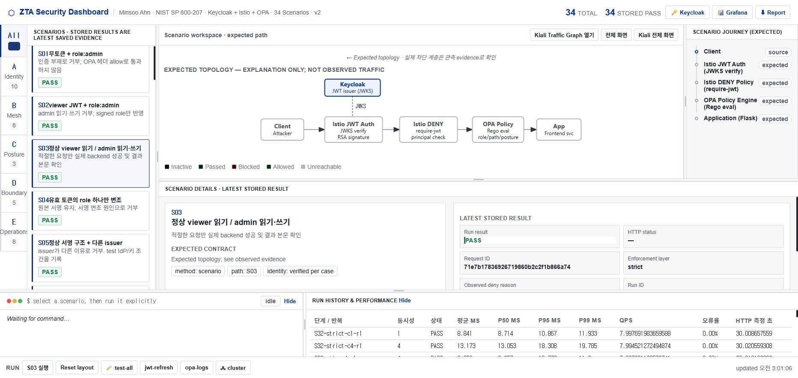
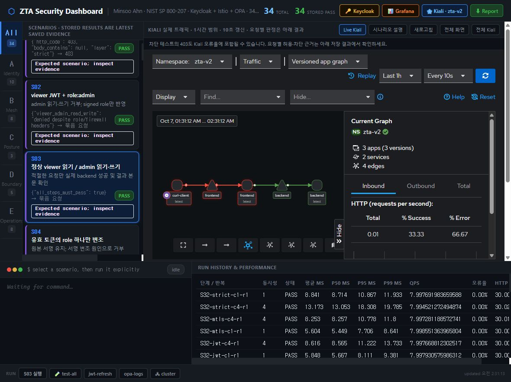

# Kiali 연결과 UI 후속 확인 — 2026-10-07

## Latest correction: English UI and theme switch

The dashboard now starts in English and dark mode. The header button switches between Light mode and Dark mode, and the browser saves the chosen theme. A missing or invalid preference falls back to dark. Shared CSS variables keep the existing panel layout and resize controls consistent in both themes. Scenario titles and descriptions use an English presentation mapping; stored API data and evidence remain unchanged.

The Node UI check covers both script blocks, dark default, theme switching/persistence, invalid preferences, and resize behavior. The three dashboard API regression checks pass. The API data hash remains `72f7beeb41b77ab176b554a864cfd93f3bab60935636618bc132f8cabe502177`, and the event file count remains 4. No scenario or cluster action was run for this correction. Browser screenshots are saved in `images/v2-ui-english-dark.jpg` and `images/v2-ui-english-light.jpg`.

Browser QA confirms all 34 cards and the selected S03 details are English, with no visible Hangul. The switch survives reload, both themes render correctly, resize controls still work, and Kiali opens/closes through its English button with no initial iframe request. The final browser is left in dark mode. The earlier light-default screenshot below is historical and is replaced by this correction.

## 최신 변경: 가독성과 패널 크기 조절

아래 이전 기록의 "기본 Kiali" 동작은 이번 변경으로 대체했다. 현재는 설명 그래프를 기본으로 표시하고 **Kiali Traffic Graph 열기** 버튼을 누를 때만 실제 Kiali를 불러온다. 처음 iframe에는 src가 없고, 닫으면 about:blank로 해제하며, 새로고침 후에도 닫힌 상태로 시작한다.

밝은 배경, 일정한 글자 크기와 여백, 간단한 시나리오 카드와 상세 결과로 화면을 정리했다. 원시 결과는 펼쳐서 보는 항목으로 옮겼다. 데이터/API/실행 제어/보안 정책은 이번 변경 대상이 아니다.

- 데스크톱: 목록/작업 영역, 설명 그래프/여정, 그래프/상세, 상단/하단, 로그/성능의 5개 경계를 실제 드래그로 확인했다. 키보드 방향키·Home·End와 최소/최대 제한도 확인했다.
- 저장한 크기는 새로고침 후 복원된다. Reset layout은 레이아웃 설정만 지운다. 부모 높이를 먼저 복원해 그래프 높이가 잘못 축소되는 문제를 고쳤다.
- 800px 화면: 가로 넘침 없이 세로로 배치된다. 목록과 여정 높이 드래그를 확인했다. 전체 작업 영역은 내용 높이에 맞추므로 이 화면에서는 바깥쪽 상단/하단 조절 경계를 숨긴다.
- Kiali가 열린 상태에서 경계를 드래그한 후 pointer capture, body resizing, iframe pointer-events가 정상으로 복구됨을 확인했다. 실제 zta-v2 Traffic Graph의 노드와 간선도 표시됐다.
- 시나리오 S03 선택은 실행 버튼만 활성화했다. 새 테스트/성능 측정/클러스터 변경은 하지 않았다.
- Node `tests/ui_layout_check.cjs` 통과: 실제 함수의 크기 제한/비정상 값/화면별 방향 및 DOM 대상 존재 검사. Python dashboard API 회귀 3개 통과. 브라우저 JavaScript 오류 없음.
- API 데이터 SHA256은 변경 전후 `72f7beeb41b77ab176b554a864cfd93f3bab60935636618bc132f8cabe502177`로 동일했고, 실행 event 파일도 4개로 동일했다. 원본 저장소의 변경은 앞서 승인한 README.md만이다.

이 검증은 UI 범위이며 현재 소스에서 전체 34개 시나리오나 30개 성능 측정을 다시 통과했다고 주장하지 않는다. 아래 항목은 이전 UI 작업의 기록이다.

이번 작업은 원본 README에 승인한 회고문을 추가하고, v2 대시보드의 그래프·선택·실행 흐름을 고친 작업이다. 인증·인가 정책, 앱, 클러스터 설정은 변경하지 않았다. 전체34개와 성능30회 재실행은 이번 확인 범위가 아니다.

## 변경

- 원본 README의 기존 내용을 보존하고 `AI를 활용해 ZTA를 다시 개선해 보며` 글을 추가했다. 원본 Git 변경은 README.md만이다.
- 기본 그래프는 실제 Kiali2.17 화면이다. iframe으로 localhost:20010의 `zta-v2` namespace를 직접 연결했다. 프록시나 보안 헤더 변경은 추가하지 않았다.
- `kiosk=true`, `animation=true`, 1시간 범위, 10초 갱신을 사용한다. 애니메이션은 Kiali 자체 기능이며, 설명용 SVG를 실제 트래픽처럼 움직이지 않는다.
- 이전 SVG는 `시나리오 설명` 탭에 예상 경로로 남겨뒀다. 카드는 선택만 하고, 하단의 `Sxx 실행` 버튼으로 실행한다.
- iframe 부모의 높이·overflow를 수정해 Kiali 툴바 아래 실제 그래프가 보이게 했다. 실행 버튼은 하단에 고정했다.
- 저장된 결과와 예상 계약을 구분하고, 현재 UI 변경 뒤 모든34개를 새로 검증한 결과로 표시하지 않는다.

## 확인한 결과

| 확인 | 결과 |
|---|---|
| 카드 선택만으로 실행되는지 | S03 선택 전후 event 파일2개로 동일; 새 실행 없음 |
| UI에서 S03 실행 | PASS — 정상 읽기·관리·쓰기 및 입력 경계, strict 복원 |
| UI에서 S01 실행 | PASS — 무토큰 요청403, strict 복원 |
| 대시보드 API/보호 회귀 | Python3개 PASS |
| inline JavaScript | Node 구문 검사 PASS |
| 브라우저 | 실제 Kiali namespace/노드/간선과 트래픽 표시 확인; JS 오류 없음 |
| 원본 변경 범위 | README.md만 변경; 원본 코드/정책 변경 없음 |

S03 실행: `e1f7a25d-cace-4774-b36d-bdde0bb6b6ab`. S01 실행: `ece59a0f-a1c6-407a-9d1f-41f82677c6cf`. 두 실행의 소스 fingerprint는 `5df0772f61d466b63864df4601dbbe23248ae01db887d51f96b38a6a4934826e`이며 실행 중 변경 없이 종료했다. 이후 Kiali 안내 문구만 한국어로 바꿨고 로직·레이아웃은 변경하지 않았다. [UI 확인 기록](../../evidence/v2/ad4665ac-21ad-44f9-9a74-d780f40f87fa/ui-smoke.json)에 각 실행과 현재 소스 fingerprint를 함께 기록했다.

## 다시 확인하는 순서

1. `http://localhost:5002/`에서 실제 Kiali 그래프를 확인한다. 필요하면 `전체 화면` 또는 `전체 Kiali`를 사용한다.
2. S03 카드를 선택한다. 선택만으로 실행되지 않고 하단 `S03 실행` 버튼이 활성화되어야 한다.
3. 실행 버튼을 누르고 터미널 PASS와 저장된 결과의 run ID를 확인한다.
4. Kiali의 다음 갱신을 확인한다. S01을 실행하면 요청별 결과는403이어야 한다.

Kiali는 수집된 트래픽의 집계 화면이다. 한 요청의 정확한 시간·차단 계층을 추적하는 화면은 아니다. TLS 이전 차단은 HTTP 그래프에 나타나지 않을 수 있고, 보안 차단 테스트의403도 Kiali에서는 오류율로 집계될 수 있다. 개별 판정 근거는 저장된 시나리오 결과를 확인한다.

기존 [34개 전체 검증 결과](RESULTS.md)는 당시 frozen source의 기록이다. UI 수정 및 승인된 원본 README 문서 변경 후 전체 `verify`가 다시 통과했다고 주장하지 않는다.
